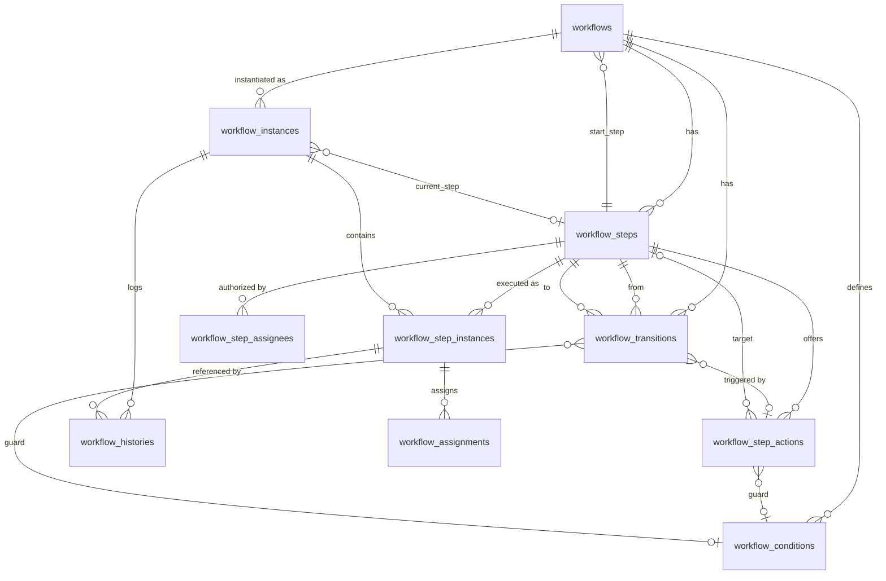

# Workflow Engine — Entity Relationship Diagram (ERD)

> **Scope of this file:** Data model only — entities, columns, types, keys, relationships.
> Business rules live in [`BRD.md`](./BRD.md). Status/type lifecycles live in [`STATE_MACHINES.md`](./STATE_MACHINES.md).

---

## Conventions (applied to every table)

| Concern | Convention |
|---|---|
| Internal PK | `id` — `BIGINT` (auto-increment / `BIGSERIAL`) |
| Public key | `uuid` — `UUID` v4, unique |
| Timestamps | `created_at`, `updated_at`, `deleted_at` — all `TIMESTAMPTZ` |
| Soft delete | `is_deleted` `BOOLEAN` (default false) + `deleted_at` |
| Audit columns | `created_by`, `updated_by`, `deleted_by` — `BIGINT`, nullable, → host `users.id` |
| Type / status fields | `VARCHAR` constrained by **application PHP enums/constants** — no `lookup_*` tables, no DB `ENUM` |
| User references | nullable `BIGINT` → host `users.id` (the package does not own `users`) |
| Tenancy | `tenant_id` `BIGINT` nullable on definition + instance tables (optional) |
| Table prefix | configurable; `workflow_` shown here as default |
| JSON columns | `JSON`/`JSONB` for config and data bags |

> **History table is the exception:** append-only — it has `created_at` only (no `updated_at`, no soft-delete columns).

Audit + soft-delete + timestamp columns are omitted from the per-column tables below for brevity and are present on every table **except `workflow_histories`** as noted.

---

## ER Diagram

---

## DEFINITION TABLES (design-time)

### 1. `workflows`
The versioned blueprint.

| Column | Type | Notes |
|---|---|---|
| id | BIGINT PK | |
| uuid | UUID UK | |
| tenant_id | BIGINT, null | optional tenancy |
| name | VARCHAR | display name |
| code | VARCHAR | machine name; unique per `(tenant_id, code, deleted_at)` |
| description | TEXT, null | |
| type | VARCHAR | `automation` \| `approval` \| `generic` |
| subject_type | VARCHAR, null | target model class; null = generic |
| version | INT | default 1 |
| is_current_version | BOOLEAN | only one true per `code` |
| status | VARCHAR | `draft` \| `active` \| `archived` |
| start_step_id | BIGINT, null FK → workflow_steps.id | entry point |
| require_explicit_transitions | BOOLEAN | disable sequential fallback if true |
| config | JSON, null | engine-level settings |

### 2. `workflow_steps`
Nodes of a workflow.

| Column | Type | Notes |
|---|---|---|
| id | BIGINT PK | |
| uuid | UUID UK | |
| workflow_id | BIGINT FK → workflows.id | |
| name | VARCHAR | |
| code | VARCHAR | unique per `(workflow_id, code, deleted_at)` |
| description | TEXT, null | |
| type | VARCHAR | `start` \| `task` \| `approval` \| `automated` \| `gateway` \| `end` |
| position | INT | ordering / sequential fallback |
| authorization_mode | VARCHAR | `public` \| `roles` \| `permissions` \| `users` \| `custom` |
| match_mode | VARCHAR | `any` \| `all` (assignee match + completion quorum) |
| custom_authorizer | VARCHAR, null | class ref for `custom` mode |
| handler | VARCHAR, null | class ref for `automated` steps |
| is_skippable | BOOLEAN | default false |
| is_returnable | BOOLEAN | default false |
| sla_seconds | INT, null | drives `due_at` + escalation |
| config | JSON, null | |

### 3. `workflow_step_assignees`
Polymorphic authorization targets for a step (per BR-A-*).

| Column | Type | Notes |
|---|---|---|
| id | BIGINT PK | |
| uuid | UUID UK | |
| step_id | BIGINT FK → workflow_steps.id | |
| assignee_type | VARCHAR | `role` \| `permission` \| `user` \| `public` \| `custom` |
| assignee_value | VARCHAR, null | role/permission name, or user id as string |
| custom_resolver | VARCHAR, null | class ref returning eligible users |
| sort_order | INT | |

### 4. `workflow_step_actions`
Actions offered at a step (per BR-AC-*).

| Column | Type | Notes |
|---|---|---|
| id | BIGINT PK | |
| uuid | UUID UK | |
| step_id | BIGINT FK → workflow_steps.id | |
| name | VARCHAR | |
| code | VARCHAR | unique per `(step_id, code, deleted_at)` |
| label | VARCHAR, null | UI label |
| type | VARCHAR | `submit` \| `approve` \| `reject` \| `skip` \| `return` \| `complete` \| `cancel` \| `custom` |
| availability_mode | VARCHAR | `general` \| `conditional` \| `custom` |
| guard_condition_id | BIGINT, null FK → workflow_conditions.id | for `conditional` |
| guard_class | VARCHAR, null | for `custom` availability |
| target_step_id | BIGINT, null FK → workflow_steps.id | explicit route |
| requires_comment | BOOLEAN | default false |
| handler | VARCHAR, null | side-effect class ref |
| sort_order | INT | |

### 5. `workflow_conditions`
Reusable guards (per BR-C-*).

| Column | Type | Notes |
|---|---|---|
| id | BIGINT PK | |
| uuid | UUID UK | |
| workflow_id | BIGINT, null FK → workflows.id | null = global/reusable |
| name | VARCHAR | |
| code | VARCHAR | |
| kind | VARCHAR | `expression` \| `custom` \| `composite` |
| expression | JSON, null | `{logic:"and|or", clauses:[{field,operator,value}], groups:[…]}` for `expression`/`composite` |
| evaluator | VARCHAR, null | class ref for `custom` |

### 6. `workflow_transitions`
Directed edges + routing (per BR-R-*).

| Column | Type | Notes |
|---|---|---|
| id | BIGINT PK | |
| uuid | UUID UK | |
| workflow_id | BIGINT FK → workflows.id | |
| from_step_id | BIGINT, null FK → workflow_steps.id | null = from start |
| to_step_id | BIGINT, null FK → workflow_steps.id | null = to end |
| action_id | BIGINT, null FK → workflow_step_actions.id | triggering action |
| condition_id | BIGINT, null FK → workflow_conditions.id | guard |
| type | VARCHAR | `forward` \| `skip` \| `return` \| `conditional` \| `automatic` |
| priority | INT | higher first for auto/conditional |

---

## RUNTIME TABLES (execution-time)

### 7. `workflow_instances`
A running workflow bound to a subject.

| Column | Type | Notes |
|---|---|---|
| id | BIGINT PK | |
| uuid | UUID UK | |
| tenant_id | BIGINT, null | |
| workflow_id | BIGINT FK → workflows.id | |
| workflow_version | INT | pinned at start |
| subject_type | VARCHAR | polymorphic subject (`workflowable`) |
| subject_id | BIGINT | polymorphic subject |
| current_step_id | BIGINT, null FK → workflow_steps.id | convenience pointer; authoritative current = active step instances |
| status | VARCHAR | `pending` \| `in_progress` \| `on_hold` \| `completed` \| `cancelled` \| `rejected` \| `failed` |
| context | JSON, null | runtime data bag |
| initiated_by | BIGINT, null | → host users |
| started_at | TIMESTAMPTZ, null | |
| completed_at | TIMESTAMPTZ, null | |

> Index: `(subject_type, subject_id)`, `(workflow_id, status)`.

### 8. `workflow_step_instances`
Per-step runtime record.

| Column | Type | Notes |
|---|---|---|
| id | BIGINT PK | |
| uuid | UUID UK | |
| workflow_instance_id | BIGINT FK → workflow_instances.id | |
| step_id | BIGINT FK → workflow_steps.id | |
| status | VARCHAR | `pending` \| `active` \| `completed` \| `skipped` \| `returned` \| `rejected` \| `failed` |
| entered_at | TIMESTAMPTZ, null | |
| completed_at | TIMESTAMPTZ, null | |
| due_at | TIMESTAMPTZ, null | from `sla_seconds` |
| acted_by | BIGINT, null | → host users |
| action_taken | VARCHAR, null | action `code` used to leave |
| comment | TEXT, null | |
| data | JSON, null | step-local data / handler output |

> Index: `(workflow_instance_id, status)`.

### 9. `workflow_assignments`
Runtime task assignments for approval/task steps (per BR-X-24).

| Column | Type | Notes |
|---|---|---|
| id | BIGINT PK | |
| uuid | UUID UK | |
| step_instance_id | BIGINT FK → workflow_step_instances.id | |
| assignee_id | BIGINT | → host users |
| status | VARCHAR | `pending` \| `acted` \| `reassigned` \| `expired` |
| assigned_at | TIMESTAMPTZ, null | |
| acted_at | TIMESTAMPTZ, null | |

> Index: `(assignee_id, status)` for the task-inbox query.

### 10. `workflow_histories` *(append-only)*
Immutable audit trail (per BR-H-*). **No `updated_at`, no soft-delete columns.**

| Column | Type | Notes |
|---|---|---|
| id | BIGINT PK | |
| uuid | UUID UK | |
| workflow_instance_id | BIGINT FK → workflow_instances.id | |
| step_instance_id | BIGINT, null FK → workflow_step_instances.id | |
| from_step_id | BIGINT, null FK → workflow_steps.id | |
| to_step_id | BIGINT, null FK → workflow_steps.id | |
| action_code | VARCHAR, null | |
| event | VARCHAR | `started` \| `step_entered` \| `step_completed` \| `action_performed` \| `skipped` \| `returned` \| `completed` \| `cancelled` \| `comment_added` \| `error` |
| actor_id | BIGINT, null | → host users; null = system |
| actor_type | VARCHAR | `user` \| `system` |
| comment | TEXT, null | |
| metadata | JSON, null | changes / payload snapshot |
| performed_at | TIMESTAMPTZ | |
| created_at | TIMESTAMPTZ | append-only |

> Index: `(workflow_instance_id, performed_at)` for the activity feed.

---

## Relationship summary

- `workflows` 1—N `workflow_steps`, `workflow_transitions`, `workflow_conditions`, `workflow_instances`.
- `workflows` N—1 `workflow_steps` (via `start_step_id`).
- `workflow_steps` 1—N `workflow_step_assignees`, `workflow_step_actions`, `workflow_step_instances`.
- `workflow_steps` referenced twice by `workflow_transitions` (`from_step_id`, `to_step_id`) and by `workflow_step_actions.target_step_id`.
- `workflow_conditions` referenced by `workflow_transitions.condition_id` and `workflow_step_actions.guard_condition_id`.
- `workflow_instances` 1—N `workflow_step_instances`, `workflow_histories`; N—1 `workflow_steps` (via `current_step_id`).
- `workflow_step_instances` 1—N `workflow_assignments`, `workflow_histories`.
- Polymorphic: `workflow_instances.(subject_type, subject_id)` → any host model (`workflowable`).
