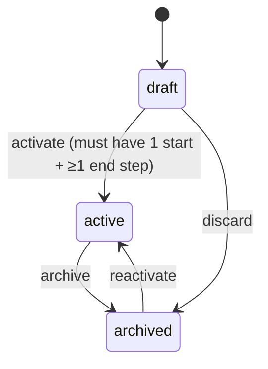
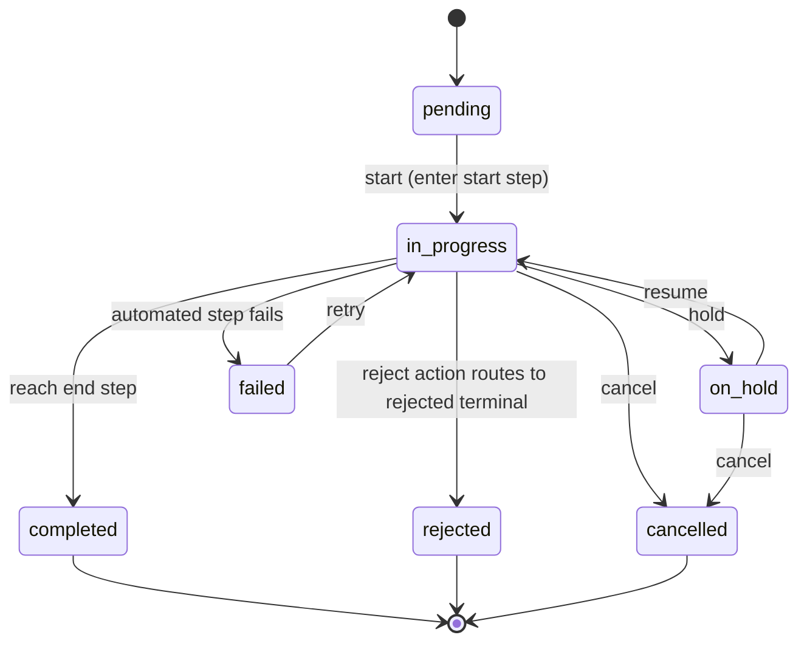
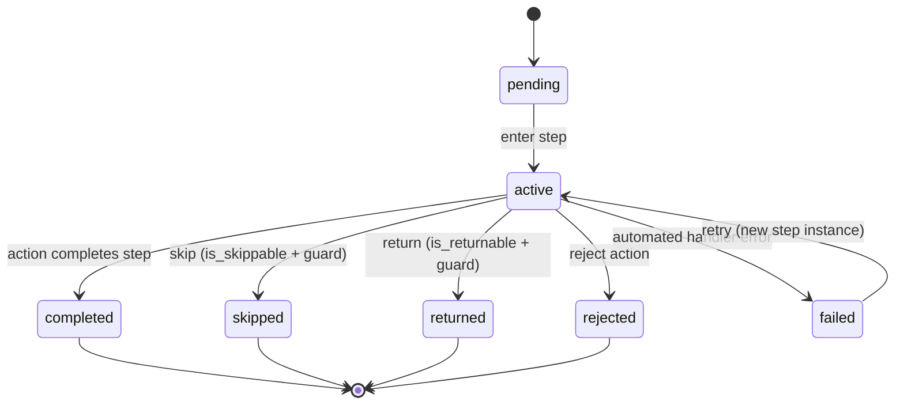
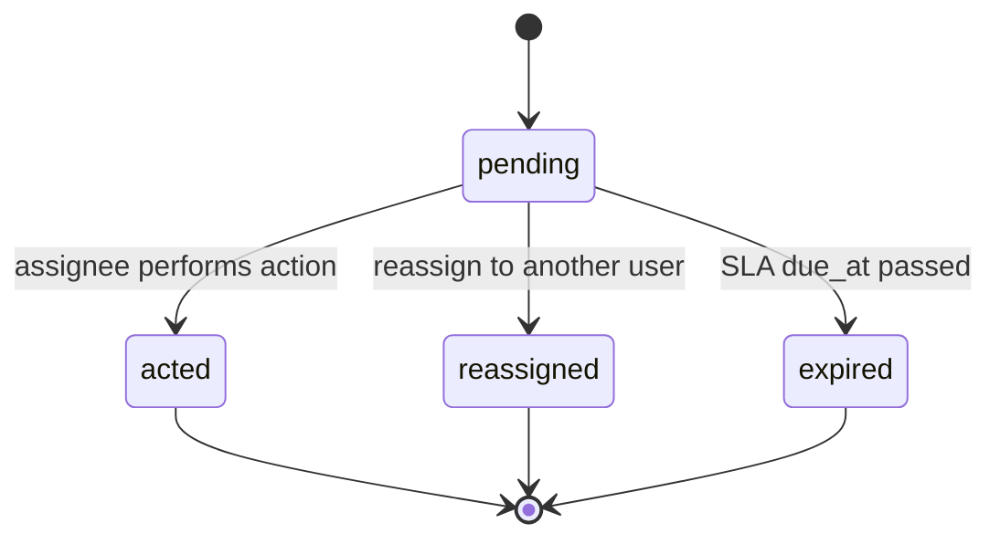

# Workflow Engine — State Machines

> **Scope of this file:** Complete lifecycle definitions for every status field.
> No status value exists outside these machines. Values are `VARCHAR` backed by PHP enums/constants (no `lookup_*`, no DB `ENUM`).

---

## 1. `workflows.status` — Definition lifecycle

| From | Event | To | Guard |
|---|---|---|---|
| draft | activate | active | exactly one `start` step and at least one `end` step exist |
| active | archive | archived | — |
| archived | reactivate | active | — |
| draft | discard | archived | — |

Rules: only `active` workflows may start instances. Structural edits to a workflow with live instances require a new **version**, not a status change.

---

## 2. `workflow_instances.status` — Instance lifecycle

| From | Event | To | Notes |
|---|---|---|---|
| pending | start | in_progress | pins `workflow_version`, enters start step, writes `started` |
| in_progress | hold | on_hold | host-initiated pause |
| on_hold | resume | in_progress | |
| in_progress | reach end | completed | sets `completed_at` |
| in_progress | reject (terminal) | rejected | when reject routes to a rejected end |
| in_progress | automated failure | failed | step instance also `failed` |
| failed | retry | in_progress | re-enters failed step as a new step instance |
| in_progress / on_hold | cancel | cancelled | terminal; remaining active steps closed |

Terminal states: `completed`, `rejected`, `cancelled`. `failed` is recoverable (retry) — not terminal.

---

## 3. `workflow_step_instances.status` — Step lifecycle

| From | Event | To | Guard |
|---|---|---|---|
| pending | enter | active | sets `entered_at`, computes `due_at` |
| active | complete | completed | eligible actor performs a completing action; `match_mode = all` requires quorum |
| active | skip | skipped | step `is_skippable` **and** skip guard passes |
| active | return | returned | step `is_returnable` **and** return guard passes; target re-entered as new step instance |
| active | reject | rejected | reject action performed |
| active | handler error | failed | automated steps only |
| failed | retry | active | spawns a fresh step instance (history preserved) |

> Return never mutates history; it appends `returned` + `step_entered` events (BR-X-19/20).

---

## 4. `workflow_assignments.status` — Assignment lifecycle

| From | Event | To |
|---|---|---|
| pending | act | acted |
| pending | reassign | reassigned |
| pending | SLA breach | expired |

In `match_mode = any`, the first `acted` assignment completes the step and the engine marks the remaining `pending` assignments `expired`. In `match_mode = all`, the step completes only when all assignments are `acted`.

---

## Enumerated value reference (application constants — not lookup tables)

| Field | Allowed values |
|---|---|
| `workflows.type` | automation, approval, generic |
| `workflows.status` | draft, active, archived |
| `workflow_steps.type` | start, task, approval, automated, gateway, end |
| `workflow_steps.authorization_mode` | public, roles, permissions, users, custom |
| `workflow_steps.match_mode` | any, all |
| `workflow_step_assignees.assignee_type` | role, permission, user, public, custom |
| `workflow_step_actions.type` | submit, approve, reject, skip, return, complete, cancel, custom |
| `workflow_step_actions.availability_mode` | general, conditional, custom |
| `workflow_conditions.kind` | expression, custom, composite |
| `workflow_transitions.type` | forward, skip, return, conditional, automatic |
| `workflow_instances.status` | pending, in_progress, on_hold, completed, cancelled, rejected, failed |
| `workflow_step_instances.status` | pending, active, completed, skipped, returned, rejected, failed |
| `workflow_assignments.status` | pending, acted, reassigned, expired |
| `workflow_histories.event` | started, step_entered, step_completed, action_performed, skipped, returned, completed, cancelled, comment_added, error |
| `workflow_histories.actor_type` | user, system |
